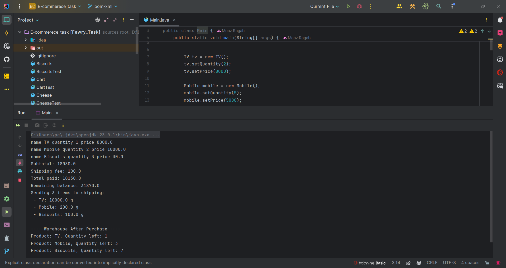

# E-Commerce Application

A Java-based e-commerce platform supporting product catalog, shopping cart, and checkout with both digital and physical products.

---

## 📸 Demo

---
## Unit tests coverage

---
## 🛠️ Prerequisites

- Java 8+  
- Maven or Gradle (for building and testing)  
- JUnit 5 (unit tests)
